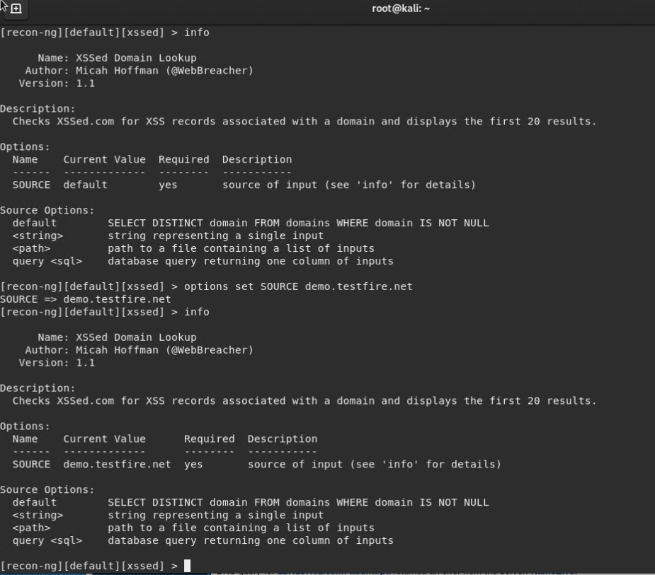
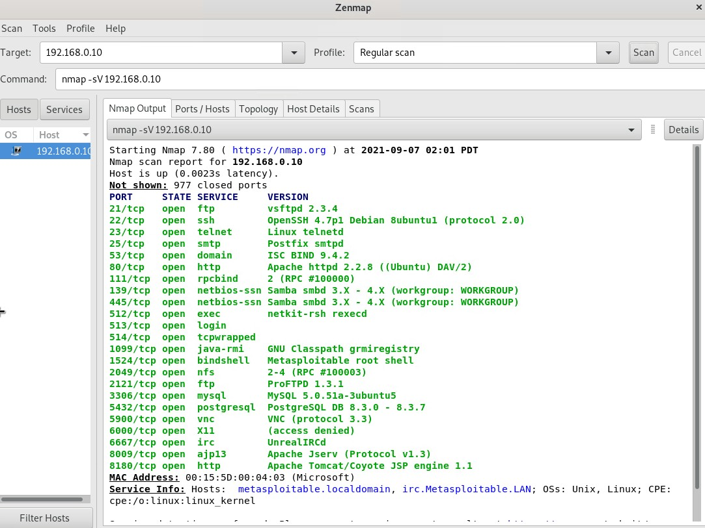
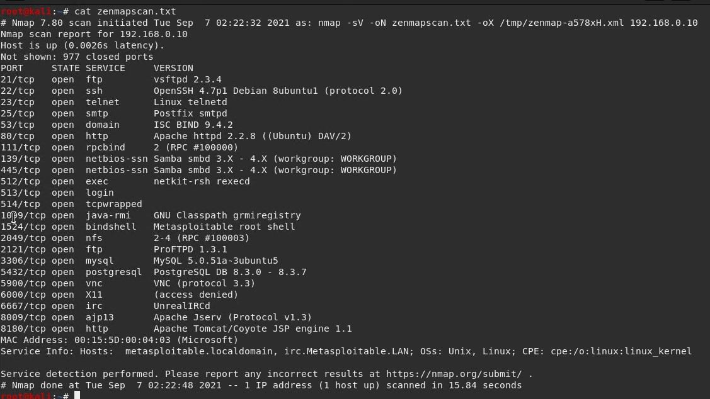

## Week 16 Homework Submission File: Penetration Testing 1

#### Step 1: Google Dorking

- Using Google, can you identify who the Chief Executive Officer of Altoro Mutual is:
 
  >In Google we can enter `site:demo.testfire.net intext:executive` which will result in a google dorking result as follows
  
  
  
  >This shows us a couple of pages within Altoro Mutual's site, one listing executives and management with Karl Fitzgerald being listed as the CEO and the other showing a community annual report that is signed by the CEO showing his last name spelt correctly and incorrectly.
  
  
  
  

- How can this information be helpful to an attacker:
  
  >An attacker can use this information to devise a targeted phishing campaign towards Karl Fitzgerald, on top of this the information can be used for further reconnaissance such as tracking down social media profiles and linkedin to gain more information about the target to help to perform better social engineering attacks. 

#### Step 2: DNS and Domain Discovery

Enter the IP address for `demo.testfire.net` into Domain Dossier and answer the following questions based on the results:

  1. Where is the company located: 
  
   >The company is located in Sunnyvale, 94085, CA, US. NOTE - This information does not come up using the IP Address as seen below since the domain name isn't
    linked to the IP Address properly. I used the domain instead in Domain Dossier to retrieve the required information.
    
   Using IP Address
   
   
   
   Using Domain
   
   

  2. What is the NetRange IP address:
  
  >65.61.137.64 - 65.61.137.127

  3. What is the company they use to store their infrastructure:
  
    CustName:       Rackspace Backbone Engineering
    Address:        9725 Datapoint Drive, Suite 100
    City:           San Antonio
    StateProv:      TX
    PostalCode:     78229
    Country:        US

  4. What is the IP address of the DNS server:
  
  >65.61.137.117

#### Step 3: Shodan

- What open ports and running services did Shodan find:
> Port 80 - http - Apache Tomcat/Coyote JSP engine 1.1

> Port 443 - https/SSL - Apache Tomcat/Coyote JSP engine 1.1

> Port 8080 - http-proxy - Apache Tomcat/Coyote JSP engine 1.1

#### Step 4: Recon-ng

> Open terminal in Kali and run `recon-ng`

- Install the Recon module `xssed`.

> In recon-ng run `marketplace install xssed` to install xssed

- Set the source to `demo.testfire.net`.

> Load the `xssed` module by running `modules load recon/domains-vulnerablilities/xssed`

> Run `info` to see the current setup.

> Set the source by running `options set SOURCE demo.testfire.net` then run `info` again to make sure the source is set.

- Run the module. 

> To run the module execute the `run` command.

Is Altoro Mutual vulnerable to XSS:

> Yes Altoro Mutual is vulnerable to XXS as stated in the report and has been since 2011.

### Step 5: Zenmap

Your client has asked that you help identify any vulnerabilities with their file-sharing server. Using the Metasploitable machine to act as your client's server, complete the following:

- Command for Zenmap to run a service scan against the Metasploitable machine: 

> In the Kali terminal run `sudo zenmap` to open Zenmap

> Input the Metasploitable machine IP `192.168.0.10` into the Target field.

> Select the Regular Scan profile and select the profile tab at the top and select Edit Selected Profile.

> Click the Scan tab and check the Version detection (-sV) and save the changes.

> Press the Scan button to complete the scan.

> Results are as follows.

 
- Bonus command to output results into a new text file named `zenmapscan.txt`:

> You can do this one of two ways, firstly in the Zenmap GUI you can select the Scan tab at the top left and select Save Scan. 
> The second way is to add `-oN zenmapscan.txt` at the end of the command field and press scan.

- Zenmap vulnerability script command: 

- Once you have identified this vulnerability, answer the following questions for your client:
  1. What is the vulnerability:

  2. Why is it dangerous:

  3. What mitigation strategies can you recommendations for the client to protect their server:

---
© 2020 Trilogy Education Services, a 2U, Inc. brand. All Rights Reserved.  

